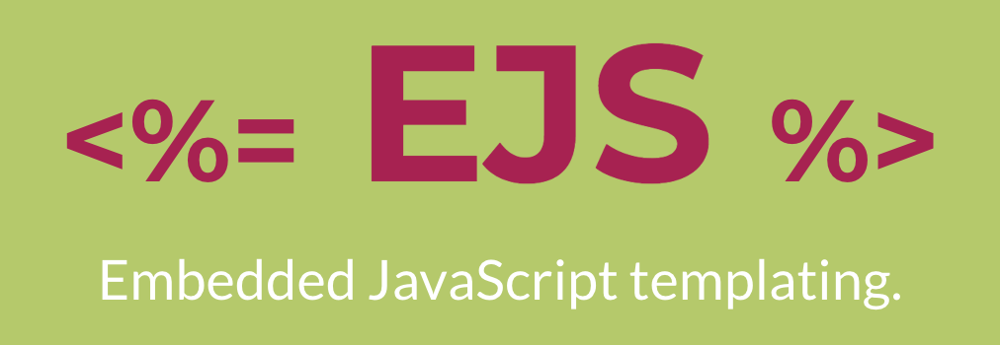

# Chore Bear
* Chore Bear lets you add and delete chores on the main page by selecting which category of chore, then adding the chore itself.  

* You can scroll down and see your chores in this main view or you can click the 'chore stores' button (top-right) and see each chore type by itself, where you can also add and delete chores. 

* When you're done with a chore click the 'x' to remove the item, and move down the line until all of your chores are done!

* To share your list with anyone else, share your user name and password so that they can sign in on their device, then they will also have access to the same chores. 

* You can add as needed and delete when completed!

**Attribution**:
I use images from 'We Bare Bears' from the cartoon network. The main input and the sign-in page background are both their property, as well as the image in the main form where one would add chores.
link to We Bare Bears info: https://en.wikipedia.org/wiki/We_Bare_Bears

 |  |  |  |
------------ | ------------- | ------------ | ------------- 
Express for all routing needs. | EJS templating for rendering of views | PostgreSQL to store user information. | Bcrypt for hashing user passwords.
